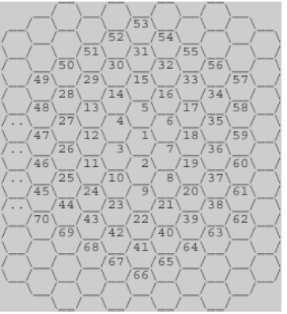

## 2292. 벌집

### 문제
<p align="center">

</img>
</p>

위의 그림과 같이 육각형으로 이루어진 벌집이 있다. 그림에서 보는 바와 같이 중앙의 방 1부터 시작해서 이웃하는 방에 돌아가면서 1씩 증가하는 번호를 주소로 매길 수 있다. 숫자 N이 주어졌을 때, 벌집의 중앙 1에서 N번 방까지 최소 개수의 방을 지나서 갈 때 몇 개의 방을 지나가는지(시작과 끝을 포함하여)를 계산하는 프로그램을 작성하시오. 예를 들면, 13까지는 3개, 58까지는 5개를 지난다.

### 입력
첫째 줄에 N(1 ≤ N ≤ 1,000,000,000)이 주어진다.

### 출력
입력으로 주어진 방까지 최소 개수의 방을 지나서 갈 때 몇 개의 방을 지나는지 출력한다.

### 예제 입력 1
```
13
```

### 예제 출력 1
```
3
```

### 알고리즘 분류
* 수학

#

1 
2 ~ 7 범위 의 숫자는 1로부터 2칸  
8 ~ 19 범위의 숫자는 1로부터 3칸 
20 ~ 37 범위의 숫자는 1로부터 4칸

칸이 더 갈수록 +6 되는 패턴이 있음  

1 + 6 + 6 + 6 ...

해당 패턴을 이용하여 규칙 수립  

### improved.c
수학적인 규칙을 사용하여 좀 더 간략하게 코드개선


