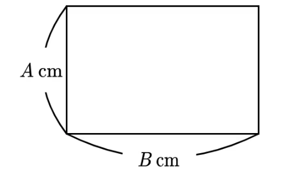

## 27323. 직사각형

### 문제
정수 A, B 가 주어진다. 세로 길이가 A cm, 가로 길이가 B cm 인 아래와 같은 직사각형의 넓이를 cm2 단위로 구하시오.



### 입력
표준 입력에 다음과 같은 형태로 입력이 주어진다.
```
A
B
```

### 출력
세로 길이가 A cm, 가로 길이가 B cm인 직사각형의 넓이를 cm2 단위로 구하고, 단위 (cm2)를 생략하여 출력한다.

### 예제 입력 1
```
2
3
```

### 예제 출력 1
``` 
6
```

### 예제 입력 2
```
100
1
```

### 예제 출력 2
``` 
100
```

### 예제 입력 3
```
4
4
```

### 예제 출력 3
``` 
16
```

### 알고리즘 분류
* 수학
* 기하학
* 사칙연산
  
#

scanf 로 입력받아 입력받은 값을 직사각형 넓이 공식 (가로 x 세로)에 대입하여 계산후
출력한다.
